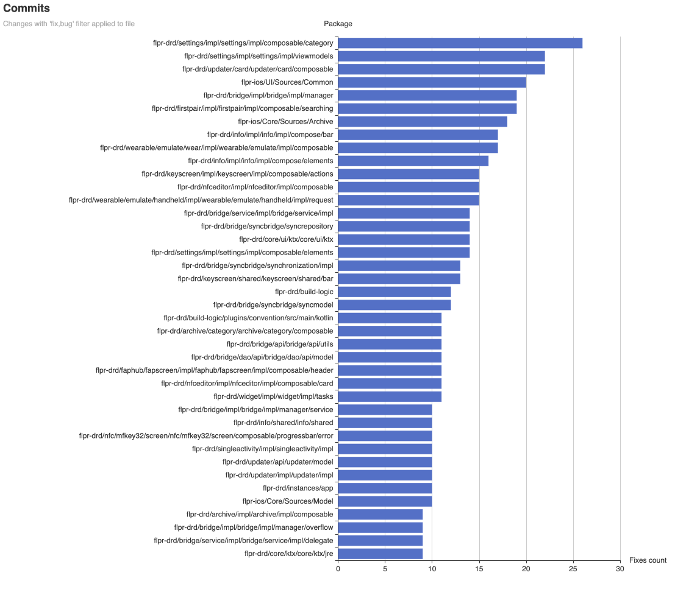
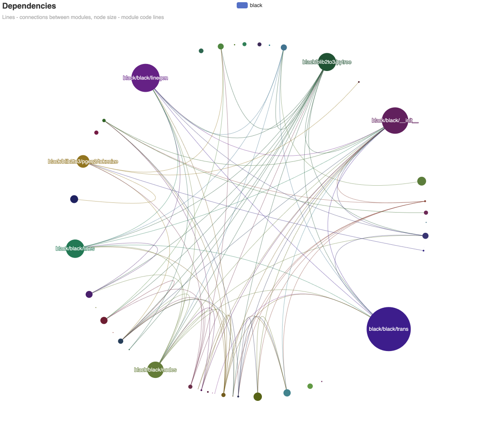

Collects and visualizes code repository data.

## Visualizations

### Code changes per month

Shows "hot" packages and files.

 *Screenshot of Flipper [iOS](https://github.com/flipperdevices/Flipper-iOS-App) and [Android](https://github.com/flipperdevices/Flipper-Android-App) codebase visualization. [This filter applied](http://localhost:1080/?project_ids=3&project_ids=4&per_files=true&package_filter=%21res%2Fdrawable%3B%21test%3B%21thirdparty&name_filter=.kt%2C.swift%3B%21.pb.swift%3B%21test&trim_package=Flipper%2FPackages%2F%2Ccomponents%2F%2Csrc%2Fmain%2Fjava%2Fcom%2Fflipperdevices%2F&commit_filters=fix%2Cbug&file_filters=todo%2Cnote%2Cfix)*

Helps to compare project changes distribution. Illustrates:
- Active development.
- Bottleneck files.

### File sizes tree map

Helps to compare projects code base size and organisation. Illustrates:
- Different code lines per task ratio (see example).
- "Big ball of mug" files and packages.

 *Screenshot of Flipper [iOS](https://github.com/flipperdevices/Flipper-iOS-App) and [Android](https://github.com/flipperdevices/Flipper-Android-App) codebase visualization. [This filter applied](http://localhost:1080/?project_ids=3&project_ids=4&per_files=true&package_filter=%21res%2Fdrawable%3B%21test%3B%21thirdparty&name_filter=.kt%2C.swift%3B%21.pb.swift%3B%21test&trim_package=Flipper%2FPackages%2F%2Ccomponents%2F%2Csrc%2Fmain%2Fjava%2Fcom%2Fflipperdevices%2F&commit_filters=fix%2Cbug&file_filters=todo%2Cnote%2Cfix)*

### Last year contribution

Helps to know the contributor of specific packages and shows the bus factor (notice splitting).

 *Screenshot of Flipper Android codebase visualization. [This filter applied](http://localhost:1080/?project_ids=3&package_filter=%21res%2Fdrawable%3B%21test%3B%21thirdparty&name_filter=.kt%2C.swift%3B%21.pb.swift%3B%21test&trim_package=Flipper%2FPackages%2F%2Ccomponents%2F%2Csrc%2Fmain%2Fjava%2Fcom%2Fflipperdevices%2F%2Csrc%2Fmain%2Fkotlin%2Fcom%2Fflipperdevices%2F%2Chronization%2Fimpl%2F&commit_filters=fix%2Cbug&file_filters=todo%2Cnote%2Cfix)*

### Commit messages and files content

Helps to visualize file fix rate, some notes, or specific content (try `money,billing,order`).

 *Screenshot of Flipper [iOS](https://github.com/flipperdevices/Flipper-iOS-App) and [Android](https://github.com/flipperdevices/Flipper-Android-App) codebase visualization. [This filter applied](http://localhost:1080/?project_ids=3&project_ids=4&package_filter=%21res%2Fdrawable%3B%21test%3B%21thirdparty&name_filter=.kt%2C.swift%3B%21.pb.swift%3B%21test&trim_package=Flipper%2FPackages%2F%2Ccomponents%2F%2Csrc%2Fmain%2Fjava%2Fcom%2Fflipperdevices%2F%2Csrc%2Fmain%2Fkotlin%2Fcom%2Fflipperdevices%2F%2Chronization%2Fimpl%2F&commit_filters=fix%2Cbug&file_filters=todo%2Cnote%2Cfix)*

 *Screenshot of Flipper [iOS](https://github.com/flipperdevices/Flipper-iOS-App) and [Android](https://github.com/flipperdevices/Flipper-Android-App) codebase visualization. [This filter applied](http://localhost:1080/?project_ids=3&project_ids=4&package_filter=%21res%2Fdrawable%3B%21test%3B%21thirdparty&name_filter=.kt%2C.swift%3B%21.pb.swift%3B%21test&trim_package=Flipper%2FPackages%2F%2Ccomponents%2F%2Csrc%2Fmain%2Fjava%2Fcom%2Fflipperdevices%2F%2Csrc%2Fmain%2Fkotlin%2Fcom%2Fflipperdevices%2F%2Chronization%2Fimpl%2F&commit_filters=fix%2Cbug&file_filters=todo%2Cnote%2Cfix)*

Notes:
- Use `Commit graphs filters` and `File content graphs filters` settings.
- Use `-tags="custom,content,tag"` flag in `new` cli command to customize file content indexing.

### Dependency chart

Compares module size with dependents count.

 *Screenshot of [Black](https://github.com/psf/black) codebase visualization. [This filter applied](http://localhost:1080/?project_ids=5&per_files_imports=true&package_filter=%21test%3B%21profiling&name_filter=.py&trim_package=src%2F&commit_filters=fix%2Cbug&file_filters=)*

- Only Go and Python are supported.
- Line color - connection with the same color module imported.

## Why

Just for fun and...

### It helps:

1. Quickly introduce newbies into the codebase using files and contributors visualization.
2. Enrich your tech debt-fighting plan with problems places visualization.
3. Compare different teams' cognitive loading in lines of code.
4. Quickly get insights on important packages to ask for details (consultants and mentors option).

### Disclaimer

1. Huge files or a thousand package line changes per month are issues, but not in all cases.
2. These visualizations can not be used alone.
   You should combine it with performance metrics, error logs, linter issues, code coverage, and survey results.

## How to use

Sorry. 
You need to use Go package manager to install devex. 
You can easily [install it from here](https://go.dev/doc/install).

> If you are interested in binary, please comment on [this issue](https://github.com/rusinikita/devex/issues/1).
I'll provide you with the binary as quickly as possible.

1. Install it with `go install github.com/rusinikita/devex@latest`
2. `devex new {{project slug}} {{path}}` - it will put project data into `devex.db`
   - Ignore `panic: close of closed channel`, that's OK.
   - Repeat that step onto other projects now or later.
3. `devex server` - it will start single page server 
   - go to [localhost:1080](http://localhost:1080)

If you have any questions, please ask and provide feedback on issues.
